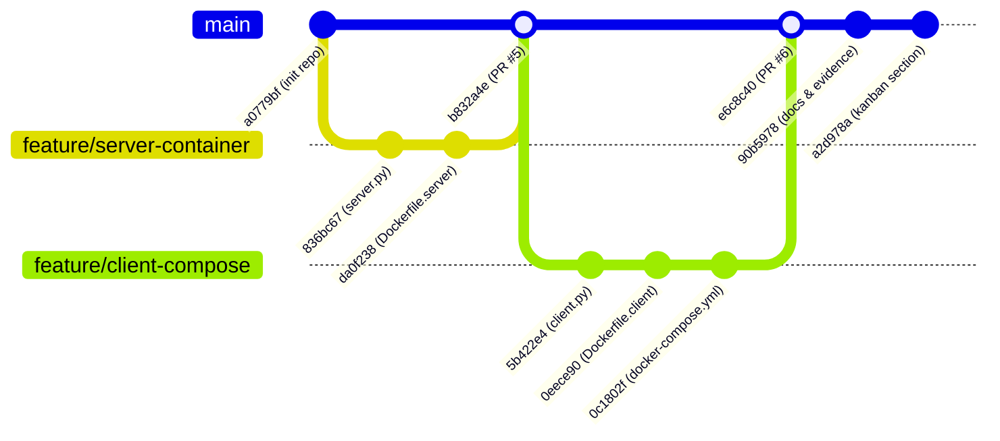

# Project Overview & Workflow Architecture

The project is an educational lab demonstrating Docker containerization, inter-container networking, host port publishing, Docker Compose orchestration, and collaborative Git branching:



---

## 1. Commit `da0f238` — Containerize Server Application

- **Commit Hash**: `da0f238fae77576f908d782d92b76a5ea0d56d7c`
- **Author**: `arshiaizd <izdyaria@gmail.com>`
- **Branch**: `feature/server-container`
- **Affected File**: [`Dockerfile.server`](file:///Users/amin/Desktop/Software_Workshop_5_Docker/Dockerfile.server)

### 💬 User Prompt to Gemini Flash
> *"I have a Python script `server.py` that runs a basic HTTP server on port 80 using only standard libraries. I need to containerize this with a dedicated `Dockerfile.server`.
> 
> Requirements:
> 1. Use the lightest possible official Python image (prefer Alpine 3.10).
> 2. Follow container best practices: dedicated working directory `/app`, copy only necessary files, and document port exposure.
> 3. Use JSON array syntax (`CMD [...]`) to execute the server so it receives OS signals properly.
> 
> Please write the `Dockerfile.server` and give me the docker commands to test building and running it locally on host port 8000."*

### 🤖 Gemini Flash Response & Result Summary
* **Architectural Rationale**:
  Gemini Flash recommended `python:3.10-alpine` to keep the image footprint minimal (~50MB) while avoiding bloat from build tools since the script uses only the standard library.
* **Generated Dockerfile**:
  ```dockerfile
  FROM python:3.10-alpine

  WORKDIR /app

  COPY server.py .

  EXPOSE 80

  CMD ["python", "server.py"]
  ```
* **Verification Instructions**:
  ```bash
  docker build -f Dockerfile.server -t my-server .
  docker run -d -p 8000:80 --name test-server my-server
  curl http://localhost:8000
  ```
* **Suggested Commit Message**: `feat: containerize server application`

---

## 2. Commit `0eece90` — Containerize Client Application

- **Commit Hash**: `0eece903612ffc3a2edff93611498ae6a537aef6`
- **Author**: `MohammadAminKoohi <M.amin.koohi@gmail.com>`
- **Branch**: `feature/client-compose`
- **Affected File**: [`Dockerfile.client`](file:///Users/amin/Desktop/Software_Workshop_5_Docker/Dockerfile.client)

### 💬 User Prompt to Gemini Flash
> *"I need to write `Dockerfile.client` to containerize our `client.py` script. The client connects to an external server address, makes 5 GET requests, and exits.
>
> Questions and requirements:
> 1. Should we use the same `python:3.10-alpine` base image?
> 2. Does a client container that only makes outbound requests need an `EXPOSE` instruction?
> 3. What should the working directory and execution command look like?"*

### 🤖 Gemini Flash Response & Result Summary
* **Architectural Clarification**:
  Gemini Flash clarified that `EXPOSE` is only metadata documenting incoming listening ports. Because the client acts purely as a network requester (outbound traffic), `EXPOSE` should be omitted to follow the principle of least privilege.
* **Generated Dockerfile**:
  ```dockerfile
  FROM python:3.10-alpine

  WORKDIR /app

  COPY client.py .

  CMD ["python", "client.py"]
  ```
* **Suggested Commit Message**: `feat: containerize client application`

---

## 3. Commit `0c1802f` — Configure Compose Networking & Service Discovery

- **Commit Hash**: `0c1802fdc7b951d2c7c7d94515362400bf5af061`
- **Author**: `MohammadAminKoohi <M.amin.koohi@gmail.com>`
- **Branch**: `feature/client-compose`
- **Affected File**: [`docker-compose.yml`](file:///Users/amin/Desktop/Software_Workshop_5_Docker/docker-compose.yml)

### 💬 User Prompt to Gemini Flash
> *"We now have `Dockerfile.server` and `Dockerfile.client`. I need to orchestrate both using Docker Compose in `docker-compose.yml`.
>
> Requirements:
> 1. Define two services: `my-server` and `my-client`.
> 2. `my-server` should build using `Dockerfile.server` and expose container port 80 to host port 8000.
> 3. `my-client` should build using `Dockerfile.client`.
> 4. `my-client` needs to find `my-server` dynamically. Our client script reads the `SERVER_HOST` environment variable. How do we configure Compose so client can reach the server by name?
> 5. Ensure `my-client` starts after `my-server` using `depends_on`.
>
> Please generate `docker-compose.yml` and explain how Docker's internal DNS handles the communication."*

### 🤖 Gemini Flash Response & Result Summary
* **Networking & DNS Explanation**:
  When Docker Compose runs, it creates a dedicated default user-defined bridge network. Within this network, Docker's embedded DNS server automatically maps service names to their respective container IP addresses. By passing `SERVER_HOST: my-server`, the client resolves `http://my-server:80` without hardcoded IPs.
* **Generated Configuration**:
  ```yaml
  services:
    my-server:
      build:
        context: .
        dockerfile: Dockerfile.server
      ports:
        - "8000:80"

    my-client:
      build:
        context: .
        dockerfile: Dockerfile.client
      environment:
        SERVER_HOST: my-server
      depends_on:
        - my-server
  ```
* **Testing Command**:
  ```bash
  docker compose up -d --build
  docker compose logs -f my-client
  ```
* **Suggested Commit Message**: `feat: configure compose networking`

---

## 4. Commit `90b5978` — Author Lab Report, Verification Evidence & Theoretical Answers

- **Commit Hash**: `90b5978dc774f50df844f8443320fc44e1039554`
- **Author**: `arshiaizd <izdyaria@gmail.com>`
- **Affected Files**:
  - [`README.md`](file:///Users/amin/Desktop/Software_Workshop_5_Docker/README.md) (+245 lines)
  - Evidence images: [`docs/evidence/1.png`](file:///Users/amin/Desktop/Software_Workshop_5_Docker/docs/evidence/1.png) to [`4.png`](file:///Users/amin/Desktop/Software_Workshop_5_Docker/docs/evidence/4.png)

### 💬 User Prompt to Gemini Flash
> *"We have finished the technical implementation and captured test execution screenshots into `docs/evidence/` (showing compose up, port mappings, curl test on port 8000, client logs with 5 successful requests, exec inspection, and compose down).
>
> Please write a comprehensive, formal academic lab report in Persian directly for our `README.md`.
>
> It must include:
> 1. Project intro and GitHub repository link.
> 2. Team members (`arshiaizd` and `MohammadAminKoohi`) and role division.
> 3. Detailed technical breakdown of `Dockerfile.server`, `Dockerfile.client`, and `docker-compose.yml`.
> 4. Step-by-step commands and verification results embedding the evidence images (`1.png` to `4.png`).
> 5. Summary of the GitHub branching workflow, PR links (#5 and #6), and final merge commit.
> 6. Formal, accurate answers to the three assignment theory questions:
>    - **Q1**: What is the purpose of `docker-compose.yml` and when do we use it instead of `docker run`?
>    - **Q2**: What is Kubernetes and what is its relationship with Docker?
>    - **Q3**: Explain Image, Container, and Volume in Docker."*

### 🤖 Gemini Flash Response & Result Summary
* **Deliverable**:
  Gemini Flash authored a full 250-line Persian report with clear Markdown hierarchy, code blocks, and formatted Q&A.
* **Key Theory Explanations Delivered**:
  1. **Docker Compose vs `docker run`**:
     Declarative multi-container orchestration vs imperative single-container commands. Compose handles automatic virtual network creation, service discovery, environment variables, and full stack lifecycle (`up`/`down`) in a single source of truth.
  2. **Kubernetes vs Docker**:
     Docker operates at the container level (building images and running containers). Kubernetes operates at the cluster level (orchestrating across multiple physical/virtual nodes, auto-scaling, self-healing, rolling deployments, and ingress routing).
  3. **Image vs Container vs Volume**:
     - *Image*: Read-only immutable template containing application code, runtime, and filesystem layers.
     - *Container*: Isolated, running instance of an image with a thin ephemeral writable layer.
     - *Volume*: Decoupled, persistent storage residing on the host filesystem that survives container restarts and destruction.
* **Suggested Commit Message**: `docs: add final Docker lab report and evidence`
