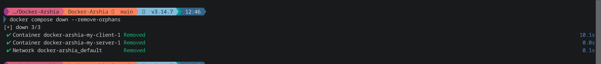
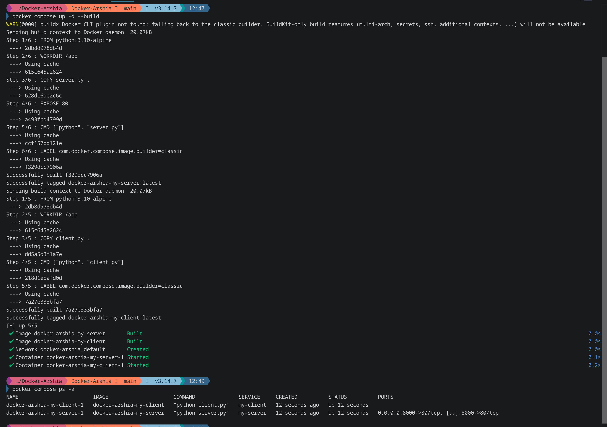
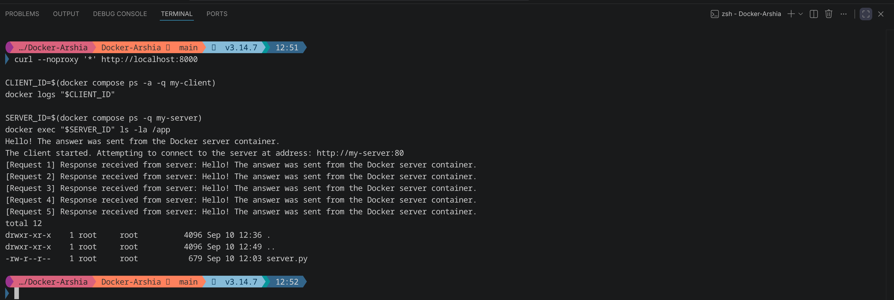
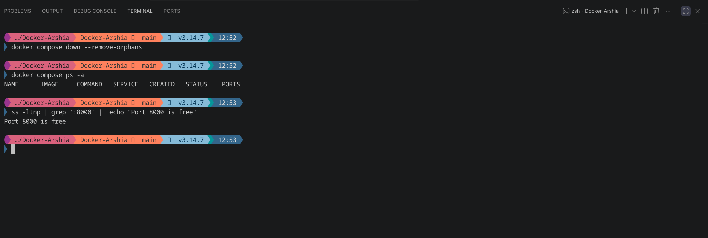

# آزمایشگاه مهندسی نرم‌افزار — Docker

## معرفی پروژه

هدف این تمرین آشنایی عملی با Docker، ساخت Image با Dockerfile، اجرای برنامه‌ها در Containerهای جداگانه، ارتباط بین Containerها از طریق شبکهٔ Docker و مدیریت چند Container با Docker Compose بود.

در این پروژه دو برنامهٔ پایتون آماده، شامل یک سرور و یک کلاینت، در اختیار ما قرار گرفت. منطق این دو برنامه تغییر داده نشد و هر کدام در Container جداگانه اجرا شدند. سرور یک HTTP Server ساده است که روی پورت 80 داخل Container اجرا می‌شود و کلاینت نیز پنج بار به سرور درخواست می‌فرستد و پاسخ دریافتی را چاپ می‌کند.

برای ارتباط بین این دو Container از شبکهٔ داخلی Docker استفاده شد. همچنین پورت 80 سرور به پورت 8000 سیستم میزبان متصل شد تا بتوان از طریق `localhost:8000` نیز به سرور دسترسی داشت.

مخزن عمومی پروژه در آدرس زیر قرار دارد:

[https://github.com/arshiaizd/Software_Workshop_5_Docker](https://github.com/arshiaizd/Software_Workshop_5_Docker)

## اعضای گروه

ارشیا ایزدیاری با نام کاربری گیتهاب `arshiaizd` و 

محمد امین کوهی با نام کاربری گیتهاب `MohammadAminKoohi`.

## تقسیم وظایف

کار مربوط به سرور توسط ارشیا انجام شده است. این بخش شامل اضافه کردن فایل `server.py` داده‌شده در صورت تمرین، ساخت `Dockerfile.server`، Build کردن Image سرور و بررسی اجرای صحیح سرور و Port Forwarding بود.

کار مربوط به کلاینت و Docker Compose توسط امین انجام شد. این بخش شامل اضافه کردن فایل `client.py` داده‌شده، ساخت `Dockerfile.client`، ساخت فایل `docker-compose.yml` و تنظیم ارتباط کلاینت با سرور از طریق شبکهٔ داخلی Docker بود.

در پایان، هر عضو Pull Request عضو دیگر را بررسی و تأیید کرد. PR مربوط به سرور توسط امین و PR مربوط به کلاینت و Docker Compose توسط ارشیا Review شد.

## ساختار پروژه

نسخهٔ نهایی پروژه شامل فایل‌های اصلی زیر است:

```text
.
├── Dockerfile.client
├── Dockerfile.server
├── client.py
├── docker-compose.yml
├── server.py
└── README.md
```

فایل `server.py` برنامهٔ HTTP Server داده‌شده در صورت تمرین است. فایل `client.py` برنامه‌ای است که آدرس سرور را از متغیر محیطی `SERVER_HOST` می‌گیرد و پنج درخواست به آن ارسال می‌کند.

دو Dockerfile جداگانه نیز برای Server و Client وجود دارد و فایل `docker-compose.yml` نحوهٔ Build، اجرا، شبکه و Port Mapping بین سرویس‌ها را مشخص می‌کند.

## Dockerfile سرور

برای Server از Image پایهٔ `python:3.10-alpine` استفاده شد. Alpine حجم کمی دارد و چون برنامهٔ ما فقط از کتابخانه‌های استاندارد Python استفاده می‌کند، نیازی به نصب Package اضافی وجود نداشت.

محتوای اصلی `Dockerfile.server` به شکل زیر است:

```dockerfile
FROM python:3.10-alpine

WORKDIR /app

COPY server.py .

EXPOSE 80

CMD ["python", "server.py"]
```

با `WORKDIR` مسیر کاری داخل Container روی `/app` قرار داده شده است. سپس `server.py` داخل این مسیر کپی می‌شود. دستور `EXPOSE 80` نشان می‌دهد برنامه داخل Container روی پورت 80 سرویس می‌دهد و در پایان با `CMD` برنامهٔ Server اجرا می‌شود.

## Dockerfile کلاینت

برای Client نیز همان Image پایهٔ `python:3.10-alpine` استفاده شد:

```dockerfile
FROM python:3.10-alpine

WORKDIR /app

COPY client.py .

CMD ["python", "client.py"]
```

در این Container نیز مسیر `/app` به عنوان مسیر کاری انتخاب شد و فایل `client.py` داخل آن قرار گرفت. چون برنامه از `urllib` استفاده می‌کند و این کتابخانه بخشی از Python Standard Library است، Package دیگری نصب نشد.

## Docker Compose و ارتباط بین Containerها

برای اجرای Server و Client در کنار هم از فایل `docker-compose.yml` استفاده شد:

```yaml
services:
  my-server:
    build:
      context: .
      dockerfile: Dockerfile.server
    ports:
      - "8000:80"

  my-client:
    build:
      context: .
      dockerfile: Dockerfile.client
    environment:
      SERVER_HOST: my-server
    depends_on:
      - my-server
```

در این فایل دو Service با نام‌های `my-server` و `my-client` تعریف شده‌اند.

سرویس `my-server` با استفاده از `Dockerfile.server` ساخته می‌شود. مقدار `"8000:80"` باعث می‌شود پورت 8000 سیستم میزبان به پورت 80 داخل Container سرور متصل شود. در نتیجه می‌توان از سیستم اصلی با آدرس `http://localhost:8000` به Server دسترسی پیدا کرد.

سرویس `my-client` با `Dockerfile.client` ساخته می‌شود. نکتهٔ اصلی در این قسمت متغیر محیطی زیر است:

```yaml
SERVER_HOST: my-server
```

برنامهٔ کلاینت مقدار `SERVER_HOST` را می‌خواند و در نتیجه به جای `localhost` به Host با نام `my-server` متصل می‌شود. Docker Compose هر دو Service را روی شبکهٔ داخلی خودش قرار می‌دهد و نام Serviceها در این شبکه قابل Resolve شدن است. به همین دلیل Client می‌تواند بدون دانستن IP سرور، از آدرس `http://my-server:80` استفاده کند.

گزینهٔ `depends_on` نیز مشخص می‌کند که Container مربوط به Server قبل از Client شروع به اجرا کند.


## Kanban


## مراحل پیاده‌سازی

در مرحلهٔ اول برنامهٔ Server داده‌شده بدون تغییر منطق آن در فایل `server.py` قرار گرفت. سپس `Dockerfile.server` ساخته شد و Image مربوط به Server با Image پایهٔ `python:3.10-alpine` Build شد. اجرای مستقل Server بررسی شد و مشخص شد برنامه در داخل Container روی پورت 80 به درستی پاسخ می‌دهد.

در مرحلهٔ بعد فایل Client داده‌شده در `client.py` قرار گرفت و برای آن `Dockerfile.client` ساخته شد. پس از Build موفق Image کلاینت، فایل `docker-compose.yml` اضافه شد تا Server و Client به صورت هم‌زمان و در یک شبکهٔ Docker اجرا شوند.

در Compose، پورت Server به شکل `8000:80` Publish شد و مقدار `SERVER_HOST` برای Client برابر `my-server` قرار گرفت. بعد از اجرای Compose، پنج درخواست Client به Server با موفقیت انجام شد و همچنین دسترسی به Server از طریق `localhost:8000` نیز بررسی شد.

## اجرای پروژه

برای Build و اجرای کل پروژه از دستور زیر استفاده می‌شود:

```bash
docker compose up -d --build
```

گزینهٔ `--build` باعث می‌شود Imageهای موردنیاز بر اساس Dockerfileها ساخته شوند و `-d` نیز Containerها را در حالت Background اجرا می‌کند.

برای مشاهدهٔ وضعیت Containerها می‌توان از دستور زیر استفاده کرد:

```bash
docker compose ps -a
```

در اجرای نهایی، سرویس `my-server` در حال اجرا باقی می‌ماند و پورت 80 آن روی پورت 8000 سیستم Publish می‌شود. برنامهٔ `my-client` پنج درخواست خود را ارسال می‌کند و پس از پایان حلقه با Exit Code صفر متوقف می‌شود.

## شواهد Build و اجرای Docker Compose

تصاویر زیر بخشی از Build و اجرای نهایی Docker Compose را نشان می‌دهند. در این مرحله هر دو Image مربوط به Server و Client ساخته شدند و Containerهای هر دو Service اجرا شدند.



در ادامهٔ همان اجرا، وضعیت Containerها و Port Mapping مربوط به Server قابل مشاهده است.



## بررسی عملکرد نهایی

برای بررسی دسترسی از سیستم میزبان، دستور زیر اجرا شد:

```bash
curl --noproxy '*' http://localhost:8000
```

پاسخ دریافت‌شده به شکل زیر بود:

```text
Hello! The answer was sent from the Docker server container.
```

این نتیجه نشان می‌دهد Port Forwarding از پورت 8000 میزبان به پورت 80 Container سرور به درستی انجام شده است.

سپس Container مربوط به Client پیدا شد و Log آن با `docker logs` بررسی شد. در Log مشخص بود که Client آدرس `http://my-server:80` را به عنوان مقصد انتخاب کرده و هر پنج درخواست پاسخ صحیح دریافت کرده‌اند.

در مرحلهٔ بعد با دستور `docker exec` وارد محیط Container سرور شدیم و دستور `ls -la /app` را اجرا کردیم. وجود فایل `server.py` در مسیر `/app` تأیید کرد که فایل برنامه به درستی داخل Image و Container قرار گرفته است.

هر سه بررسی اصلی در تصویر زیر دیده می‌شوند. بخش اول پاسخ `localhost:8000`، بخش دوم Log مربوط به پنج درخواست Client و بخش سوم نتیجهٔ اجرای `docker exec` روی Server است.



## پایان اجرای Containerها

بعد از پایان آزمایش، Containerها و شبکهٔ ساخته‌شده توسط Docker Compose با دستور زیر متوقف و حذف شدند:

```bash
docker compose down --remove-orphans
```

سپس وضعیت Compose و پورت 8000 بررسی شد. بعد از Cleanup هیچ Container مربوط به پروژه باقی نمانده بود و پورت 8000 نیز آزاد شده بود.



## روند کار در GitHub

برای اینکه سهم هر عضو در پروژه مشخص باشد، کار Server و Client روی Branchهای جداگانه انجام شد.

Arshia روی شاخهٔ `feature/server-container` کار کرد. در این Branch دو commit با موضوع اضافه کردن Server داده‌شده و Containerize کردن آن ایجاد شد. این تغییرات در Pull Request شمارهٔ 5 قرار گرفتند. PR توسط `MohammadAminKoohi` بررسی و با وضعیت `APPROVED` تأیید شد و سپس با Merge Commit وارد `main` شد.

[Pull Request #5 — Containerize server application](https://github.com/arshiaizd/Software_Workshop_5_Docker/pull/5)

Amin روی شاخهٔ `feature/client-compose` کار کرد. سه commit مربوط به Client، Dockerfile کلاینت و Docker Compose در این Branch ثبت شد. این تغییرات در Pull Request شمارهٔ 6 قرار گرفتند. PR توسط `arshiaizd` بررسی و تأیید شد و سپس با Merge Commit وارد `main` شد.

[Pull Request #6 — Add client container and Compose networking](https://github.com/arshiaizd/Software_Workshop_5_Docker/pull/6)

بعد از Merge نهایی، هر دو نسخهٔ محلی پروژه با `main` هماهنگ شدند و هر دو به commit نهایی یکسان رسیدند:

```text
e6c8c402036bc524efae189370acda49791b5e03
```

به این ترتیب هم پیاده‌سازی هر بخش و هم Code Review توسط عضو دیگر در تاریخچهٔ GitHub قابل مشاهده است.

## نتیجه‌گیری

در این تمرین دو برنامهٔ Python در دو Container مستقل اجرا شدند. برای هر برنامه Dockerfile جداگانه ساخته شد و هر دو از Image پایهٔ `python:3.10-alpine` استفاده کردند.

با استفاده از Docker Compose، اجرای Server و Client و شبکهٔ بین آن‌ها در یک فایل تنظیم شد. Client توانست با استفاده از نام Service یعنی `my-server` به Server متصل شود و هر پنج درخواست با موفقیت پاسخ دریافت کردند. همچنین با Port Mapping برابر `8000:80` امکان دسترسی به Server از سیستم میزبان از طریق `localhost:8000` فراهم شد.

در پایان نیز با `docker logs` ارتباط Client و Server و با `docker exec` محتوای Container سرور بررسی شد و اجرای صحیح کل پروژه تأیید شد.

لینک مخزن نهایی پروژه:

[https://github.com/arshiaizd/Software_Workshop_5_Docker](https://github.com/arshiaizd/Software_Workshop_5_Docker)

## سوال ها

### ۱. وظیفه فایل `docker-compose.yml` چیست و چه زمانی به جای دستور `docker run` از آن استفاده می‌کنیم؟

فایل `docker-compose.yml` تنظیمات مربوط به چند Service یا Container را در یک محل نگهداری می‌کند. در این فایل می‌توان مشخص کرد هر Service از چه Dockerfile یا Imageای ساخته شود، چه Portهایی Publish شوند، چه متغیرهای محیطی در اختیار Container قرار بگیرند و Containerها چگونه با یکدیگر ارتباط داشته باشند.

دستور `docker run` برای اجرای مستقیم یک Container مناسب است و در تست‌های ساده یا زمانی که فقط یک Container داریم استفاده از آن راحت است. اما وقتی پروژه شامل چند Container وابسته به هم باشد، استفاده از تعداد زیادی دستور `docker run` مدیریت پروژه را سخت می‌کند. در چنین حالتی Docker Compose مناسب‌تر است، چون کل تنظیمات پروژه داخل یک فایل قرار می‌گیرد و می‌توان همهٔ Serviceها را با دستورهایی مانند `docker compose up` و `docker compose down` مدیریت کرد.

در همین تمرین اگر از `docker run` استفاده می‌کردیم باید شبکه، Port و متغیر `SERVER_HOST` را جداگانه در دستورهای مختلف تنظیم می‌کردیم، در حالی که با Compose تمام این تنظیمات داخل `docker-compose.yml` مشخص شده‌اند.

### ۲. ابزار Kubernetes برای انجام چه کارهایی استفاده می‌شود و چه رابطه‌ای با داکر دارد؟

Kubernetes برای مدیریت و Orchestration تعداد زیادی Container، اجرای آن‌ها روی چند سیستم، Scaling و جایگزینی خودکار Containerهای خراب استفاده می‌شود. Docker می‌تواند Image و Container موردنیاز برنامه را ایجاد کند و Kubernetes این Containerها را در مقیاس بزرگ‌تر مدیریت و هماهنگ می‌کند.

### ۳. در داکر Image و Container و Volume را توضیح دهید.

`Image` الگوی آماده و تقریباً تغییرناپذیری است که فایل‌های برنامه، Runtime، تنظیمات و وابستگی‌های لازم برای اجرای برنامه را در خود دارد. برای مثال در این تمرین Image سرور از `python:3.10-alpine` به همراه فایل `server.py` ساخته شد.

`Container` یک نمونهٔ در حال اجرا از یک Image است. از یک Image می‌توان چند Container مستقل ساخت. تغییراتی که فقط داخل لایهٔ قابل نوشتن Container ایجاد شوند معمولاً با حذف Container از بین می‌روند، مگر اینکه داده در محل جداگانه‌ای نگهداری شود.

`Volume` فضای ذخیره‌سازی جدا از چرخهٔ عمر Container است. از Volume زمانی استفاده می‌شود که بخواهیم داده‌ها حتی بعد از حذف و ساخت دوبارهٔ Container باقی بمانند. برای مثال در برنامه‌هایی مثل Database معمولاً فایل‌های داده در Volume ذخیره می‌شوند تا حذف Container باعث از دست رفتن اطلاعات نشود.
